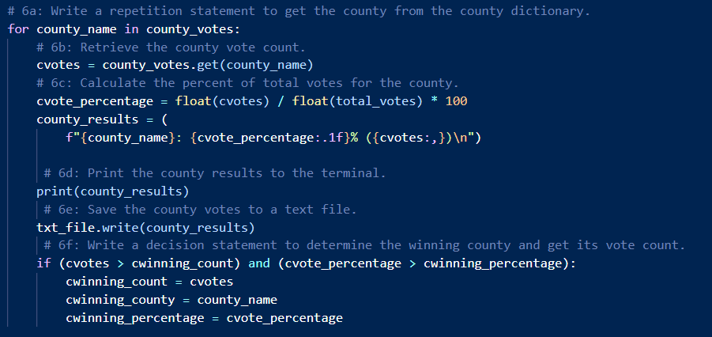
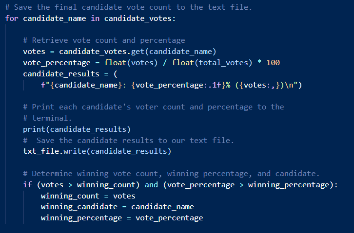
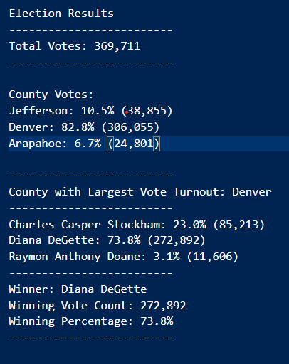

# PyPoll Challenge

## Overview of Election Audit: 

The purpose of this audit is to help Seth and Tom develop a way to efficiently tally votes for the Colorado election. This script uses Python to automate the task of counting votes for each county and candidate, calculate their respective percentages of the total vote, and declaring the county with the largest vote turnout and winning candidate.

## Election-Audit Results: 

	

Based on the above images we want the computer to keep track of the votes tied to each county and each candidate separately. I made sure that cvotes would be tied to county votes and votes to be tied to candidate votes to prevent using the wrong data in the calculations. Every time the script loops through a row that matches the county or candidate, the script will tally up a cvote or vote to that respective county/candidate. In order to find the cvote percentage or vote percentage we would divide that specific vote type with the total votes multipled by 100. Lastly we have an if statement that declares if cvotes or votes is greater than the cwinning_count or winning_count and cvote_percentage or vote_percentage is greater than the cwinning_percentage or winning percentage than we have our Largest County Turnout and Winning Candidate.

* The total amount of votes cast in this election was 369,711.
* As we can see, Arapahoe totaled at 24,801 (6.7%), Jefferson totaled at 38,855 (10.5%) and Denver totaled at 306,055 (82.8%).  
* For the County with the Largest Turnout, Denver wins this title by a large margin with 306,055 votes. 
* As for candidates, Raymon Anthony Doane received 11,606 votes (3.1%), Charles Casper Stockham received 85,213 votes (23.0%) and Diana DeGette received 272,892 votes (73.8%).
* Our winning candidate by majority vote is Diana DeGette with 272,892 votes and 73.8% of the total vote.

## Election-Audit Summary: 

In summary, this script can function as the framework for different types of elections or petitions. By simply replacing the county variables with state we can use this to calculate statewide elections such as the Presidential Election. If different departments are voting for specific job titles, we can use departments and job title as variables to replace county and candidate as well. Petitions for global topics such as votes for legalizing marijuana or right to abortion can also benefit from this script. As long as the data is formatted similarly to the election_results.csv file, we can easily transfer the design of this code to fit the situation.

